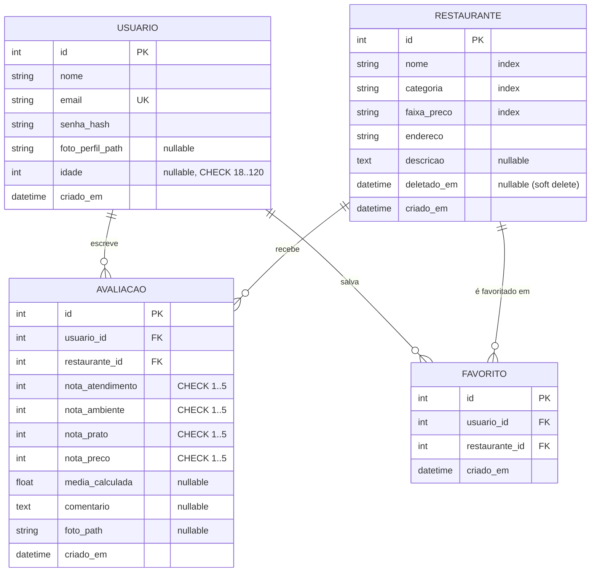

# Spec — Conformidade com os Critérios de Avaliação do Professor

**Status:** ✅ Implementada (2026-05-30)
**Data:** 2026-05-30
**Feature branch sugerida:** `feature/entrega-final`

> **Execução:** ER atualizado (Mermaid) em `docs/modelos.md`; `docs/arquitetura.md`
> sincronizado (favoritos, Talisman, Limiter, 7 testes, model `Favorito`); fail-fast de
> `SECRET_KEY` em produção; `scripts/empacotar.sh`; documentação de entrega em
> `docs/documentacao-entrega.md` (+ `.html` para impressão→PDF). Suíte 166/166, ruff limpo.
> Decisões do revisor: integrantes Isabela Carone / Isabela Campagnollo / João Antônio;
> PDF via impressão do navegador; teste de fail-fast opcional **não** incluído.

---

## 1. Contexto e motivação

A apresentação final vale 10 pontos: 3 de presença/participação e **7 distribuídos em 7
critérios técnicos** (1 ponto cada). A entrega do projeto compactado + um PDF servem de
**auditoria** desses 7 pontos.

Esta spec faz duas coisas:

1. **Mapeia cada critério ao que já existe no código** (evidência para a auditoria), porque
   a maior parte já está implementada (166 testes passando, ~97% de cobertura).
2. **Especifica apenas as lacunas implementáveis** — o que ainda precisa virar código ou
   artefato para fechar os 7 pontos e cumprir a entrega obrigatória.

> **Princípio:** não reimplementar o que já está pronto. Os critérios 1–6 estão atendidos;
> o trabalho real está no critério 7 (documentação/qualidade desatualizada) e na
> **entrega** (diagrama ER atual, empacotamento, PDF).

---

## 2. Mapa dos 7 critérios → estado atual

| # | Critério | Estado | Evidência no código | Ação nesta spec |
|---|----------|--------|---------------------|-----------------|
| 1 | Arquitetura Modular / Fábrica de Aplicação | ✅ Atende | `app/__init__.py::create_app(test_config)` — extensões inicializadas via `init_app`, blueprints registrados, error handlers, `/health` | Nenhuma (só citar no PDF) |
| 2 | Módulos / Blueprints / Rotas | ✅ Atende | 4 blueprints: `auth`, `restaurantes`, `avaliacoes`, `favoritos` (`app/<modulo>/routes.py`) | Nenhuma (atualizar doc — ver §3.2) |
| 3 | Formulários e Validação no servidor | ✅ Atende | `app/forms.py` (Flask-WTF/WTForms) + `app/validators.py` (`SenhaForte`, `UniqueEmail`, `UniqueNomeRestaurante`) + CheckConstraints no banco | Nenhuma |
| 4 | Interface / Templates / Frontend | ✅ Atende | Jinja2 + Bootstrap 5, responsivo; `app/static/js/validacao.js` (validação client-side); modal de confirmação | Nenhuma |
| 5 | Testes Automatizados | ✅ Atende | `tests/` — 166 testes passando, ~97% cobertura (pytest + pytest-flask + pytest-cov) | Nenhuma |
| 6 | Persistência / ORM / Modelagem | ✅ Atende | SQLAlchemy (4 models) + Flask-Migrate/Alembic (`migrations/versions/`) + constraints e índices | Diagrama ER atualizado (§3.1) |
| 7 | Qualidade, Organização e Boas Práticas | ⚠️ Quase | `.env.example`, logging (`RotatingFileHandler`), error handlers 403/404/413/500, `.gitignore` correto, ruff | Ajustes em §3.2, §3.3 |

**Entrega obrigatória (auditoria):**

| Item | Estado | Ação |
|------|--------|------|
| Código-fonte compactado `.zip` (sem `venv`/`__pycache__`) | ❌ Não gerado | §3.4 |
| Documento PDF (título, integrantes, descrição, **ER**, detalhamento técnico, arquitetura, tecnologias, como rodar, desafios) | ❌ Não gerado | §3.5 |

---

## 3. Lacunas implementáveis (escopo desta spec)

### 3.1 Diagrama ER atualizado — Critério 6 + entrega

**Problema:** o ER em `docs/modelos.md` está desatualizado. Ele mostra apenas 3 entidades
(`Usuario`, `Avaliacao`, `Restaurante`) e omite:

- A entidade **`Favorito`** (existe em `app/models.py`).
- Campos novos de `Usuario`: `foto_perfil_path`, `idade`.
- Campo de soft-delete `deletado_em` em `Restaurante`.
- As constraints reais (`UniqueConstraint`, `CheckConstraint`) que demonstram modelagem.

**Implementação:** substituir o desenho ASCII por um diagrama **Mermaid `erDiagram`**, que
renderiza como imagem (basta um print para o PDF) e reflete o schema real.



> Constraints a citar na legenda: `uq_avaliacao_usuario_rest` e `uq_favorito_usuario_rest`
> (1 avaliação/favorito por par usuário-restaurante); `ck_idade`, `ck_nota_*`.

**Arquivos:** `docs/modelos.md` (substituir bloco ER e a tabela de `Usuario` para incluir
`foto_perfil_path`/`idade`; adicionar seção `Favorito` e `deletado_em` em `Restaurante`).

### 3.2 Sincronizar documentação técnica — Critério 7

**Problema:** `docs/arquitetura.md` está atrás do código real. Faltam:

- Blueprint **`favoritos`** (não aparece na estrutura nem na tabela de blueprints).
- `app/favoritos/routes.py` e templates `favoritos/listar.html`.
- Camada de segurança real: **Flask-Talisman** (CSP/headers) e **Flask-Limiter**
  (rate limiting) — hoje não citados, embora estejam em `create_app`.
- `tests/` lista só 3 arquivos; existem 7 (`test_models`, `test_perfil_expandido`,
  `test_robustez`, `test_deploy`).

**Implementação:** atualizar `docs/arquitetura.md`:

1. Adicionar `favoritos/` à árvore de pastas e à tabela "Controller (blueprints)".
2. Acrescentar à tabela de Segurança as linhas: `Talisman` (CSP + cabeçalhos) e
   `Flask-Limiter` (limite de requisições por IP).
3. Atualizar a lista de `tests/` para os 7 arquivos atuais.
4. Atualizar a relação de models para incluir `Favorito` e os campos novos de `Usuario`.

### 3.3 Fail-fast de `SECRET_KEY` em produção — Critério 7

**Problema:** em `app/config.py`, `ProductionConfig.init()` faz
`cls.SECRET_KEY = os.environ.get("SECRET_KEY") or ""`. Uma `SECRET_KEY` vazia em produção
desabilita silenciosamente a proteção de sessão/CSRF — é exatamente o tipo de "boa prática"
avaliada no critério 7. Deve **falhar explicitamente** se a variável não estiver definida.

```python
class ProductionConfig(Config):
    @classmethod
    def init(cls) -> None:
        secret = os.environ.get("SECRET_KEY")
        if not secret:
            raise RuntimeError(
                "SECRET_KEY é obrigatória em produção. "
                "Defina a variável de ambiente antes de iniciar a aplicação."
            )
        cls.SECRET_KEY = secret
        cls.SQLALCHEMY_DATABASE_URI = os.environ.get(
            "DATABASE_URL", "sqlite:///mesa_certa.db"
        )
```

> **Atenção ao impacto nos testes:** `get_config()` chama `cls.init()`. Os testes usam
> `TestingConfig` (não `ProductionConfig`), então não disparam o `raise`. Confirmar rodando
> a suíte após a mudança (deve continuar 166/166).

### 3.4 Script de empacotamento da entrega — entrega obrigatória

**Problema:** a entrega exige um único `.zip` chamado `GrupoX_NomeDoProduto.zip`,
**excluindo** `venv`/`.venv` e `__pycache__`. Fazer isso à mão é propenso a erro (incluir
banco, uploads, caches).

**Implementação:** criar `scripts/empacotar.sh` que gera o zip a partir do `git archive`
(naturalmente respeita o `.gitignore`, então já exclui `.venv`, `__pycache__`, `instance/`,
`logs/`, caches):

```bash
#!/usr/bin/env bash
# Gera o zip de entrega a partir do estado versionado (respeita .gitignore).
set -euo pipefail

GRUPO="GrupoX"          # <-- ajustar com o número do grupo
PRODUTO="MesaCerta"
SAIDA="${GRUPO}_${PRODUTO}.zip"

git archive --format=zip --output="${SAIDA}" HEAD
echo "Gerado: ${SAIDA}"
unzip -l "${SAIDA}" | tail -n 1
```

> Decisão: usar `git archive` em vez de `zip -r ... -x` porque o `.gitignore` do projeto já
> está correto (verificado: nenhum `.db`, `htmlcov/`, `coverage.xml` ou `.env` rastreado).
> Assim o zip contém exatamente o que está no repositório.
>
> **Questão para o revisor:** o número do grupo e o nome do produto no arquivo
> (`GrupoX_MesaCerta.zip`) — confirmar valores.

### 3.5 Documento PDF da entrega — entrega obrigatória

**Problema:** o PDF é obrigatório; sem ele os 7 pontos técnicos são avaliados só pela
apresentação. O conteúdo já existe espalhado em `readme.markdown`, `docs/arquitetura.md`,
`docs/modelos.md` e `docs/implementacoes.md` — falta consolidar.

**Implementação:** criar `docs/documentacao-entrega.md` reunindo as seções exigidas, e
exportar para PDF (VS Code "Markdown PDF", `pandoc`, ou imprimir do navegador). Seções
obrigatórias (todas com conteúdo já disponível nas fontes citadas):

| Seção exigida | Fonte de conteúdo |
|---------------|-------------------|
| Título + integrantes | `readme.markdown` (Isabela Carone, Isabela Campagnollo, João Antônio) |
| Descrição do produto e funcionalidades | `docs/readme.md` (tabela RF01–RF09) |
| Diagrama do banco (ER) | §3.1 desta spec (Mermaid → print) |
| Detalhamento técnico com trechos | `docs/implementacoes.md` + trechos de `__init__.py`, `models.py`, `forms.py` |
| Explicação da arquitetura | `docs/arquitetura.md` (já atualizado em §3.2) |
| Tecnologias e justificativa | `readme.markdown` (Flask — vantagem natural citada pelo professor) |
| Como rodar (passo a passo) | `readme.markdown` (uv venv → uv sync → flask db upgrade → run.py) |
| Principais desafios | `docs/implementacoes.md` (ex.: isolamento de `flask.g` e engine nos testes — Sprint 7 §12) |

> **Questão para o revisor:** confirmar a ferramenta de exportação para PDF e se quer que eu
> escreva o `docs/documentacao-entrega.md` completo (essa parte é a opção "Conteúdo do PDF"
> que não foi escolhida — confirmar se entra no escopo).

---

## 4. Resumo das mudanças por arquivo

| Arquivo | Mudança | Critério |
|---------|---------|----------|
| `docs/modelos.md` | ER Mermaid com 4 entidades + campos/constraints reais | 6 / entrega |
| `docs/arquitetura.md` | Adicionar blueprint `favoritos`, Talisman, Limiter, 7 test files, model `Favorito` | 7 |
| `app/config.py` | `ProductionConfig` falha se `SECRET_KEY` ausente | 7 |
| `scripts/empacotar.sh` | Novo — gera `GrupoX_MesaCerta.zip` via `git archive` | entrega |
| `docs/documentacao-entrega.md` | Novo — consolida as 8 seções exigidas no PDF | entrega |
| `docs/documentacao-entrega.html` | Novo — versão para impressão→PDF (marked + mermaid) | entrega |
| `tests/test_deploy.py` | Ajuste — `test_config_seleciona_producao_pelo_env` passa a definir `SECRET_KEY` (nova invariante) | 7 |

Nenhuma mudança toca `models.py`, `forms.py`, rotas de runtime ou templates → **sem
migration** e sem risco de regressão funcional. O único ajuste de teste foi consequência do
fail-fast de `SECRET_KEY` (a seleção de `ProductionConfig` agora exige a variável).

---

## 5. Testes / verificação

Não há feature nova de runtime, então não há novos testes de comportamento. A verificação é:

- [x] `uv run pytest -q` continua **166 passados** após a mudança em `config.py`.
- [x] `uv run ruff check app/ run.py` sem erros.
- [x] `bash scripts/empacotar.sh` gera o zip (`git archive` respeita `.gitignore` → exclui
      `.venv/`, `__pycache__/`, `instance/`, `.env`).
- [x] Diagrama Mermaid em `docs/modelos.md` / `documentacao-entrega.html` renderiza.

> Opcional (defensivo, critério 7): um teste unitário garantindo o fail-fast de produção:
> ```python
> def test_production_exige_secret_key(monkeypatch):
>     import importlib, app.config as cfg
>     monkeypatch.delenv("SECRET_KEY", raising=False)
>     monkeypatch.setenv("FLASK_ENV", "production")
>     importlib.reload(cfg)
>     with pytest.raises(RuntimeError):
>         cfg.get_config()
> ```

---

## 6. Critérios de aceite

- [x] ER em `docs/modelos.md` reflete as 4 entidades e as constraints reais.
- [x] `docs/arquitetura.md` cita `favoritos`, Talisman, Limiter e os 7 arquivos de teste.
- [x] Iniciar em produção sem `SECRET_KEY` levanta `RuntimeError` claro.
- [x] Suíte continua 166/166 e ruff limpo.
- [x] `scripts/empacotar.sh` produz o zip de entrega nomeado corretamente.
- [x] `docs/documentacao-entrega.md` cobre as 8 seções exigidas; `.html` pronto para
      exportar como PDF (imprimir do navegador). *Falta apenas: ajustar `GRUPO` no script e
      gerar o PDF pelo navegador.*

---

## 7. Questões em aberto para o revisor

1. **Número do grupo / nome do produto** no zip (`GrupoX_MesaCerta.zip`)? → isabela carone, isabela campgnollo e joão antônio 
2. **Escrevo o `docs/documentacao-entrega.md` completo** (conteúdo do PDF) ou só o esqueleto? → sim, faça um aversão pdf e outra md
3. **Ferramenta de export PDF** (Markdown PDF do VS Code / pandoc / imprimir do navegador)? → imprimidir do navegador
4. Manter o **teste de fail-fast** opcional (§5) ou deixar de fora? → deixe fora
