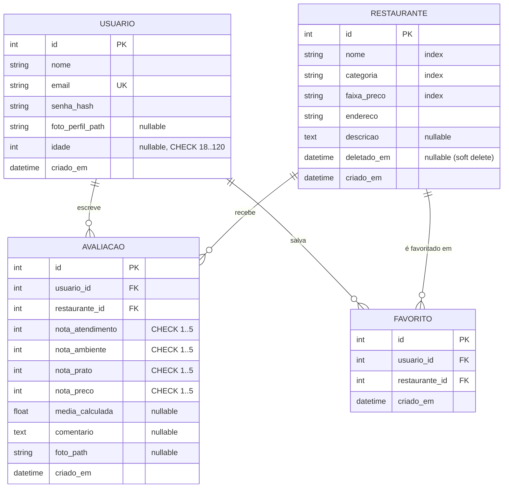

# Modelos de Dados — Mesa Certa

## Diagrama ER

**Constraints de integridade:**

| Constraint | Tabela | Garante |
|---|---|---|
| `uq_avaliacao_usuario_rest` | avaliacao | 1 avaliação por par (usuário, restaurante) |
| `uq_favorito_usuario_rest` | favorito | 1 favorito por par (usuário, restaurante) |
| `ck_idade` | usuario | `idade IS NULL OR 18 <= idade <= 120` |
| `ck_nota_atendimento/ambiente/prato/preco` | avaliacao | cada nota entre 1 e 5 |

---

## Classe `Usuario`

| Campo | Tipo | Restrição |
|---|---|---|
| id | Integer | PK, autoincrement |
| nome | String(120) | NOT NULL |
| email | String(150) | UNIQUE, NOT NULL |
| senha_hash | String(256) | NOT NULL |
| foto_perfil_path | String(256) | nullable |
| idade | Integer | nullable, CHECK 18–120 (`ck_idade`) |
| criado_em | DateTime | default=now(utc) |

**Relacionamentos:** `avaliacoes` (1:N, cascade delete), `favoritos` (1:N, cascade delete)

**Métodos:**
- `set_senha(senha: str) -> None` — gera e armazena o hash
- `check_senha(senha: str) -> bool` — valida contra o hash

---

## Classe `Restaurante`

| Campo | Tipo | Restrição |
|---|---|---|
| id | Integer | PK |
| nome | String(120) | NOT NULL |
| categoria | String(80) | NOT NULL |
| faixa_preco | String(30) | NOT NULL (`economico`, `moderado`, `sofisticado`) |
| endereco | String(200) | NOT NULL |
| descricao | Text | nullable |
| deletado_em | DateTime | nullable — soft delete (registros com valor são ocultados) |
| criado_em | DateTime | default=now(utc) |

**Properties:**
- `media_geral -> float | None` — média das médias de todas as avaliações
- `total_avaliacoes -> int` — contagem de avaliações

---

## Classe `Avaliacao`

| Campo | Tipo | Restrição |
|---|---|---|
| id | Integer | PK |
| usuario_id | Integer | FK → usuario.id |
| restaurante_id | Integer | FK → restaurante.id |
| nota_atendimento | Integer | NOT NULL (1–5) |
| nota_ambiente | Integer | NOT NULL (1–5) |
| nota_prato | Integer | NOT NULL (1–5) |
| nota_preco | Integer | NOT NULL (1–5) |
| media_calculada | Float | nullable |
| comentario | Text | nullable |
| foto_path | String(256) | nullable |
| criado_em | DateTime | default=utcnow |

**Métodos:**
- `calcular_media() -> None` — aritmética simples das 4 notas, arredondada em 2 casas

---

## Classe `Favorito`

Associa um usuário a um restaurante que ele marcou como favorito.

| Campo | Tipo | Restrição |
|---|---|---|
| id | Integer | PK |
| usuario_id | Integer | FK → usuario.id |
| restaurante_id | Integer | FK → restaurante.id |
| criado_em | DateTime | default=now(utc) |

**Constraint:** `uq_favorito_usuario_rest` — impede favoritar o mesmo restaurante duas vezes.

---

## Categorias disponíveis

`brasileira`, `italiana`, `japonesa`, `mexicana`, `americana`, `francesa`, `árabe`, `vegana`, `frutos_do_mar`, `outra`

## Faixas de preço

| Valor no BD | Exibição |
|---|---|
| `economico` | Econômico (até R$30) |
| `moderado` | Moderado (R$30 a R$80) |
| `sofisticado` | Sofisticado (acima de R$80) |
